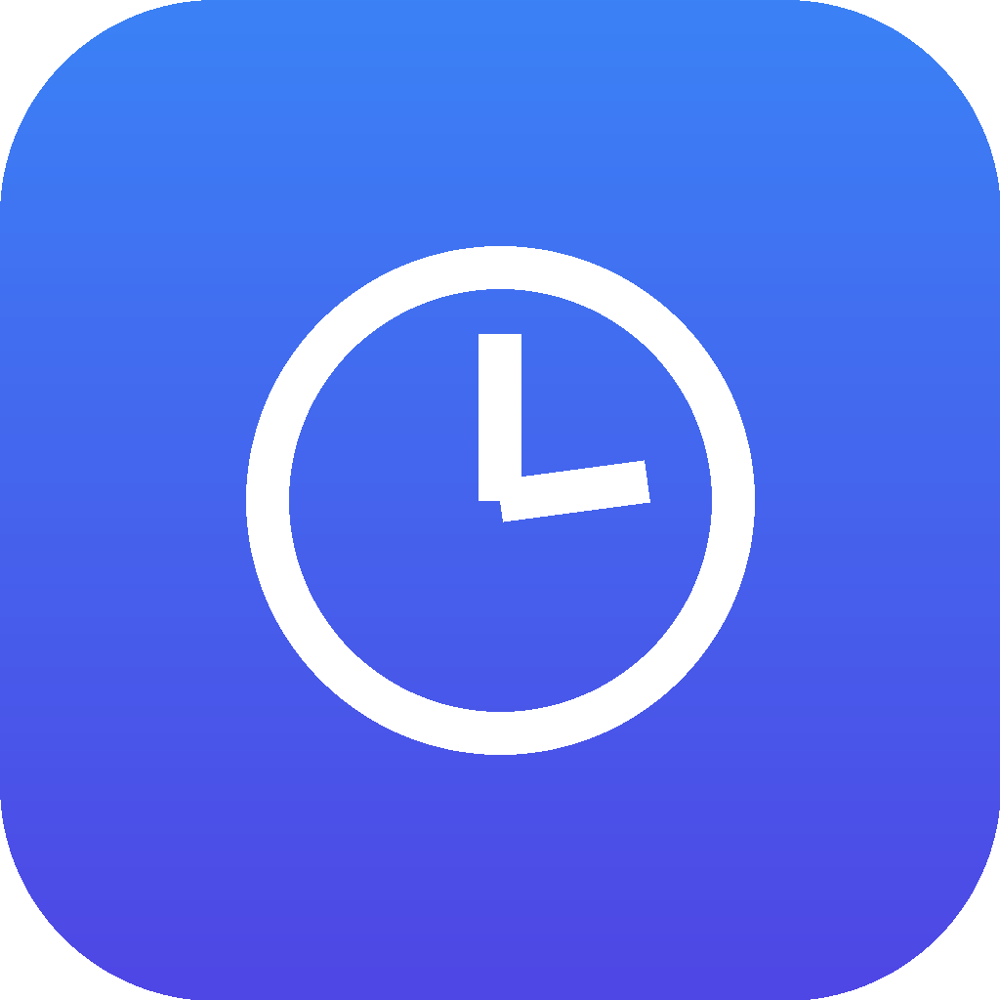

# LimitTrack

<p align="center">
  
</p>

<p align="center">
  Stop manually logging into every email account just to check if your AI coding tool's usage limit has reset.
</p>

<p align="center">
  <a href="https://github.com/YOUR-USERNAME/limittrack/releases/latest"></a>
  <a href="https://github.com/YOUR-USERNAME/limittrack/actions/workflows/release.yml"></a>
  
  
</p>

---

If you juggle multiple email accounts across AI coding tools — **Antigravity**, **Codex**, **Claude Code**, or anything else with a weekly/monthly usage cap — LimitTrack is a small native desktop app that tracks every account for you: when you last hit a limit, exactly when it resets, and which one is free to use right now.

## ✨ Features

- 🖥️ **Multi-tool, multi-account** — track as many email accounts as you want, across as many tools as you want, each with its own reset cycle
- ⏱️ **One-click logging** — hit a limit? Click "Log hit" and it stamps the time and calculates the reset automatically
- 📅 **Manual override** — already know the exact reset time? Set it directly instead of computing it from "now"
- 🔔 **Real desktop notifications** — get notified the moment an account opens back up, even in the background
- 🎨 **Clean, native UI** — light glassmorphism design, live countdowns, color-coded status
- 🗂️ **System tray** — closing the window just minimizes it; LimitTrack keeps tracking behind the scenes
- 🔒 **100% local** — everything is saved to a local file on your machine, nothing is sent anywhere

## 📥 Download

Grab the latest build for your OS from the [**Releases page**](https://github.com/YOUR-USERNAME/limittrack/releases/latest):

| Platform | File |
|---|---|
| Windows | `LimitTrack-Setup-x.x.x.exe` (installer) **or** `LimitTrack-x.x.x-portable.exe` (no install needed) |
| macOS | `LimitTrack-x.x.x.dmg` |
| Linux | `LimitTrack-x.x.x.AppImage` or `.deb` |

> **Windows SmartScreen warning:** the app isn't code-signed (that costs money), so Windows may flag it as unrecognized. Click **More info → Run anyway**. This is normal for small open-source apps.

## 🛠️ Running from source

```bash
git clone https://github.com/YOUR-USERNAME/limittrack.git
cd limittrack
npm install
npm start
```

No build step for development — it runs straight from source.

## 📦 Building installers yourself

```bash
npm run build        # build for your current OS
npm run build:win    # Windows
npm run build:mac    # macOS
npm run build:linux  # Linux
```

Installers land in `dist/`.

## 🤖 Automated releases

Push a version tag and GitHub Actions takes care of the rest — it builds installers for Windows, macOS, and Linux in parallel and publishes them straight to a GitHub Release:

```bash
git tag v1.0.0
git push --tags
```

See [`.github/workflows/release.yml`](.github/workflows/release.yml).

## 🤝 Contributing

PRs and issues welcome — see [CONTRIBUTING.md](CONTRIBUTING.md).

## 📄 License

[MIT](LICENSE) — do whatever you want with it.
